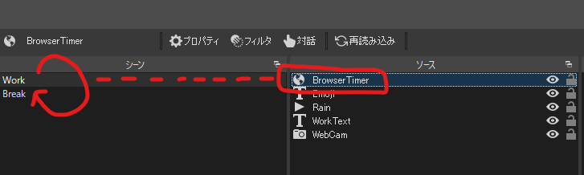

# obs-browser-sources

Utility browser sources for OBS Studio.

## pomodoro.html

Universal 50/10 pomodoro timer with auto scene switcher.

This timer is linked to the current time:

- Between 00 and 50 minutes, the remaining work time is displayed
- Between 50 and 00 minutes, the remaining break time is displayed

### Basic usage

Add a browser source with the following URL:

- https://r7kamura.github.io/obs-browser-sources/pomodoro.html

### Advanced usage

If you set **ADVANCED** permission ("OBSへの高度なアクセス" in Japanese) and there are scenes named `Work` and `Break`,
this browser source will automatically switch between the scenes according to the timer.

